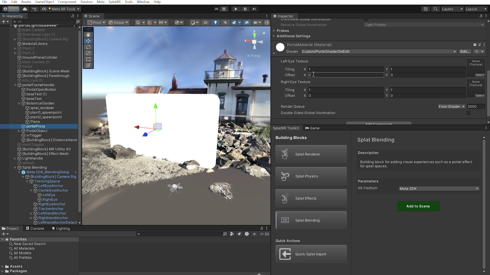

# Splat Blending

System for creating portal effects where splat spaces can be viewed through virtual windows, blending reality with the splat spaces.

Blending layer
Meta SDK · Apple Vision Pro (WIP)

!!! note
    Temporary screenshot. Will be replaced with a dedicated Splat Blending screenshot.

## Purpose

Use this building block to create portal effects where users can look through a virtual window into a different splat space.

## Parameters

| Parameter | Description |
| --- | --- |
| XR Platform | Choose **Meta SDK** or **Apple Vision Pro** (under development). |
| Camera Rig | Reference to the XR camera rig (e.g. the [Building Block] Camera Rig for Meta Quest SDK). |

## Usage

The system sets up additional cameras under the `CenterEyeAnchor` and creates a `"BlendingWorld"` layer. Objects placed in the BlendingWorld layer are only visible through the portal material. Apply the generated Blending Portal material to a mesh to create the portal window surface.

All objects visible through the portal need to be on the `"BlendingWorld"` layer. There is a controllable **Edge Softness** parameter in the material shader to create a vignette effect along the border of the portal window.
