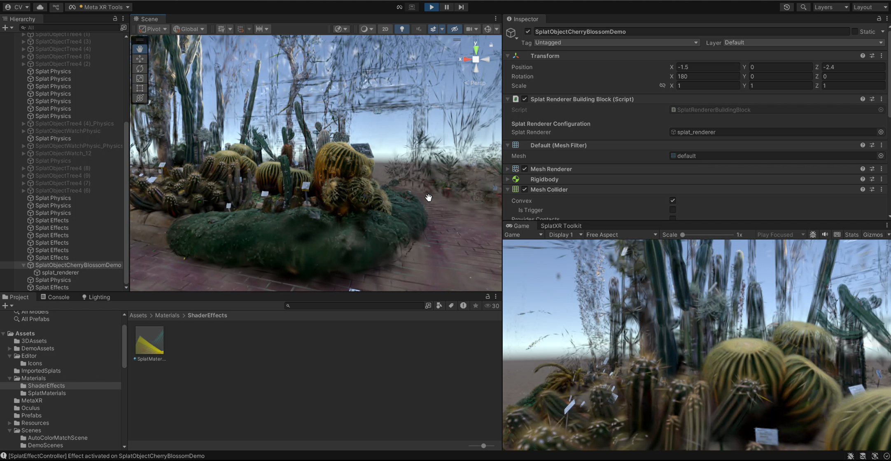

# Splat Effects

Visual effects system for applying shader-based effects to Gaussian splats, including disintegration, radial reveal, and distortion.

Effects layer
Requires Splat Renderer

!!! note
    Temporary screenshot. Will be replaced with a dedicated Splat Effects screenshot.

## Purpose

Add this building block to the parent splat GameObject to create dynamic visual effects. Useful for transitions, interactions, or stylized appearances.

## Parameters

| Parameter | Description |
| --- | --- |
| Target Splat | GameObject with a Splat Renderer component to apply effects to. |
| Effect Selection | **Disintegrate** — particle-based disintegration effect. **Radial Reveal** — spherical reveal/hide effect from a point. **Distortion** — spatial distortion effect. **Custom Effect** — placeholder for custom shader effects. |

## Usage

Effects modify the material shader on the splat renderer to achieve the visual changes. A controller script is added to the splat object, allowing for looping or specifying the timestep of the effect — each shader runs the effect across a timeline from `0` to `1`.
