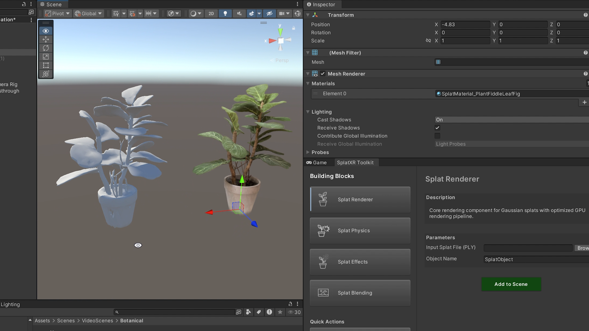

# Splat Physics

Generates collision meshes from Gaussian splats to enable physics interactions, rigid body dynamics, and shadow casting.

Physics layer
Requires Splat Renderer

!!! note
    Temporary screenshot. Will be replaced with a dedicated Splat Physics screenshot.

## Purpose

Apply this building block to an existing splat renderer object when you need collision detection, physics collisions, or shadow casting.

## Parameters

| Parameter | Description |
| --- | --- |
| Target Splat | Existing splat GameObject with a Splat Renderer component. |
| Splat Type | **Object** (detailed mesh for props/items) or **Space** (simplified mesh for rooms/environments). |
| Mesh Threshold | *(Object type)* Density threshold for mesh generation. Range 0–1, default `0.5`. |
| Gaussian Mesh Scale | *(Object type)* Scale factor for individual gaussians during meshing. Larger values help for sparser gaussians. Range 0–2, default `1.5`. |
| Mesh Base Flattening | Enable to flatten the bottom of the mesh (useful for placing objects on surfaces). |
| Flatten Percentage | *(If flattening enabled)* Amount to flatten. Range 0–1, default `0.05`. |
| Flatten Axis | *(If flattening enabled)* Axis direction for flattening, generally the base (`X`, `Y`, `Z`, `-X`, `-Y`, `-Z`). |

## Usage

**Object** meshing creates more detailed meshes suitable for interactive props, while **Space** meshing creates simplified meshes for environment boundaries.

!!! warning "Known limitation"
    Scene-based meshing (Splat Type: Space) may not produce highly detailed meshes. For objects requiring detailed collision meshes, use Splat Type: Object instead. See the [FAQ](../faq.md).
