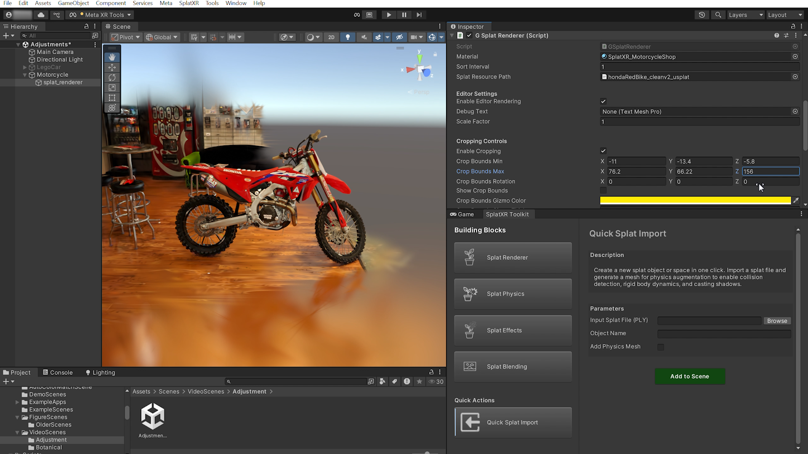

# Splat Renderer

Core rendering component for displaying Gaussian splats with our stand-alone on-device rendering pipeline.

Rendering layer
Foundational block

!!! note
    Temporary screenshot. Will be replaced with a dedicated Splat Renderer screenshot.

## Purpose

This is the foundational building block for splat rendering. Maximum recommended splat count per scene is under **200k** for optimal performance, but this may vary depending on target hardware.

## Parameters

| Parameter | Description |
| --- | --- |
| Object Name | Name for the splat GameObject. |
| Renderer | Choose between **Base Renderer** (single PLY file) or **LoD Renderer** (multiple detail levels for distance-based optimization). |
| Input Splat File (PLY) | *(Base Renderer)* Path to the splat `.ply` file. |
| High / Medium / Low Detail Splat | *(LoD Renderer)* Paths to different detail level PLY files. |

## Usage

Start with **Base Renderer** for single splats. Use **LoD Renderer** when working with large scenes where different detail levels are needed at varying distances to maintain performance. Simply import a `.ply` file and the toolkit script will create a `usplat` CSV file, which is automatically assigned to the renderer script.

!!! tip
    Enable "Remove Outline" in the in-editor viewer when selecting a splat object for smoother editor performance. See the [FAQ](../faq.md) for more details.
