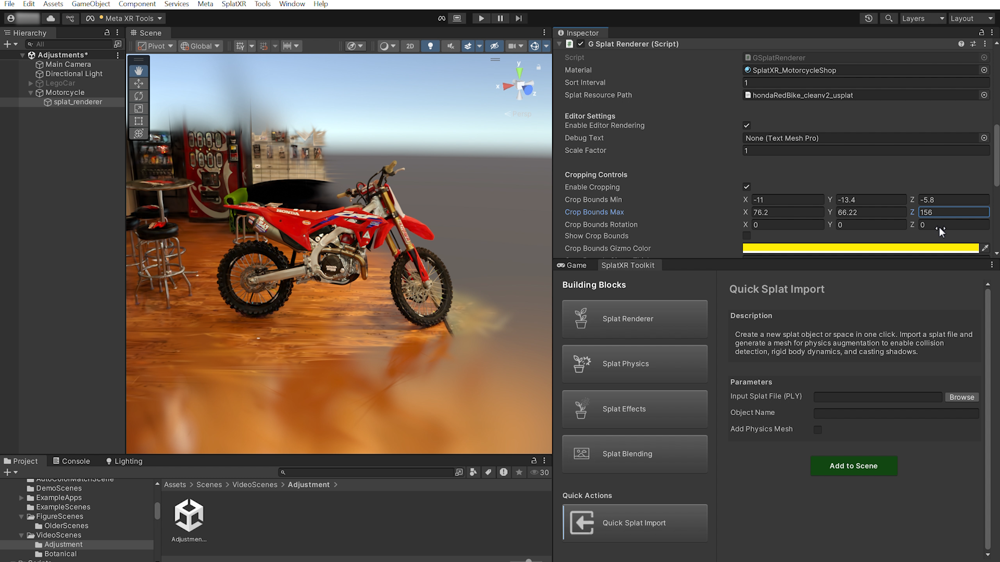
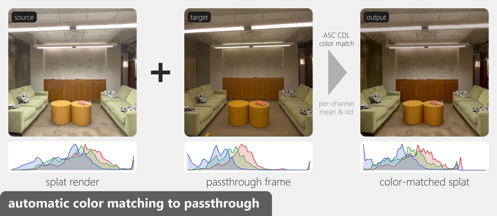

# Splat Renderer

Core rendering component for displaying Gaussian splats with our stand-alone on-device rendering pipeline.

<div class="tag-row" markdown>
<span class="tag-pill">Rendering layer</span>
<span class="tag-pill">Foundational block</span>
</div>



## Purpose

This is the foundational building block for splat rendering. Maximum recommended splat count per scene is under **200k** for optimal performance, but this may vary depending on target hardware.

## Parameters

| Parameter | Description |
| --- | --- |
| Object Name | Name for the splat GameObject. |
| Renderer | Choose between **Base Renderer** (single PLY file) or **LoD Renderer** (multiple detail levels for distance-based optimization). |
| Input Splat File (PLY) | *(Base Renderer)* Path to the splat `.ply` file. |
| High / Medium / Low Detail Splat | *(LoD Renderer)* Paths to different detail level PLY files. |

## Usage

Start with **Base Renderer** for single splats. Use **LoD Renderer** when working with large scenes where different detail levels are needed at varying distances to maintain performance. Simply import a `.ply` file and the toolkit script will create a `usplat` CSV file, which is automatically assigned to the renderer script.

The building block creates a parent GameObject (named after **Object Name**) with a `splat_renderer` child that holds the renderer component and draws the splat. Move, rotate, or scale the parent rather than the child.

!!! tip
    Enable "Remove Outline" in the in-editor viewer when selecting a splat object for smoother editor performance. See the [FAQ](../faq.md) for more details.

### LoD distances

The LoD Renderer draws one detail level per distance band from the camera. The defaults are below; change them with **Lod Distance High** and **Lod Distance Medium** on the `LoDRendererSplatXR` component of the `splat_renderer` child.

| Distance from camera | Detail level |
| --- | --- |
| Up to 2 m | High |
| 2 m – 5 m | Medium |
| Beyond 5 m | Low |

You don't need all three files. If a level has no file, its band falls back to the next coarser level that has one, then to a finer one. For example, with only High and Low assigned, the 2–5 m band uses Low. Removing a file from a level in the Inspector stops that level from rendering.

### Splat file format

The `usplat` CSV has a header line, then one splat per line with 13 comma-separated numbers:

```text
x,y,z,opacity,f_dc_0,f_dc_1,f_dc_2,cov0,cov1,cov2,cov3,cov4,cov5
```

Lines with fewer than 13 columns or non-numeric values are skipped, and the rest of the file still loads. The Console shows a warning with the number of skipped lines and the first one's line number.

## Material and Color Controls

Each splat gets its own material, saved as `Assets/Materials/SplatMaterials/SplatMaterial_<Object Name>.mat` and assigned to the `splat_renderer` child. It uses the `SplatXR/SplatShader` shader. Editing it changes only that splat, and the original splat file isn't modified.

Select the material (or the `splat_renderer` child) to adjust its photometric properties in the Inspector: **Color Tint**, **Brightness**, **Contrast**, **Saturation**, **Temperature** (cool to warm), and **Transparency**. **Scale Factor** scales the splat's size. At their defaults (white tint, `0` temperature, everything else `1`), the splat looks unchanged.

The shader applies them in this order: color correction (below), tint, temperature, saturation, then contrast and brightness.

### Auto color correction with passthrough

A splat captured at a different time or under different lighting often looks off next to the real room seen through passthrough. The **Splat Passthrough Color Adjustment** component (`SplatPassthroughColorAdjustment`) matches the splat's colors to the real environment.



To set it up:

1. Select the splat object and choose **Add Component > SplatXR > Splat Passthrough Color Adjustment**.
2. Assign a **Splat Render Image**: a capture of the splat as it renders, such as a screenshot from Unity.
3. Assign a **Passthrough Image**: a passthrough camera image of the real space the splat should match.
4. Assign the splat's material as the **Target Material**.
5. Click **Apply Color Correction** in the component.

!!! note
    Both images need **Read/Write** enabled in their texture import settings.

The component compares the mean and spread of each color channel (R, G, B) in the two images and computes an [ASC CDL](https://en.wikipedia.org/wiki/ASC_CDL) correction (slope, offset, and power) that maps the splat image's colors onto the passthrough image's. Values are clamped to a safe range so a mismatched image pair can't blow out the splat.

#### How the material is updated

The correction is stored on the material, not in the splat file. **Apply Color Correction** writes the results to the material's **ASC CDL Color Correction** properties (**ASC-CDL Slope**, **ASC-CDL Offset**, and **ASC-CDL Power**), sets **Enable ASC-CDL** to `1`, and saves the material asset. Because the values live on the material:

- The correction stays applied after you leave Play mode and in builds, even if you disable or remove the component.
- You can undo it with **Ctrl+Z** (**Cmd+Z** on macOS).
- You can fine-tune it on top with the color controls above, since the shader applies the correction first.

To compare with and without the correction, set **Enable ASC-CDL** on the material to `0` (off) or `1` (on). This keeps the computed values. **Reset Color Correction** in the component returns slope, offset, and power to neutral and turns **Enable ASC-CDL** off.

## Cropping

Cropping hides splats outside a box, which is useful for removing background clutter or floaters around a captured object. Open the **Cropping Controls** foldout on the renderer component on the `splat_renderer` child:

| Field | Description |
| --- | --- |
| Enable Cropping | Turn cropping on or off. |
| Crop Bounds Min / Max | Opposite corners of the crop box, in the splat's local space. Default `(-5, -5, -5)` to `(5, 5, 5)`. |
| Crop Bounds Rotation | Rotation of the crop box, in degrees. |
| Show Crop Bounds | Draw the crop box as a yellow wireframe in the Scene view (while cropping is on). |

Only splats inside the box are drawn, and the splat updates as soon as you change the box. Cropping doesn't change the splat file, so turning it off brings every splat back. It works with both the Base and LoD Renderers.
